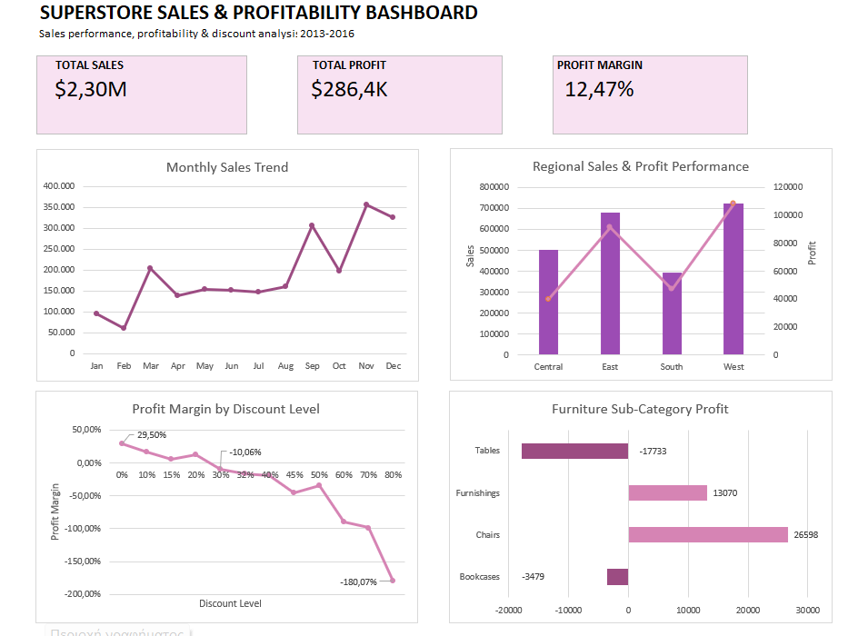

# Superstore Sales & Profitability Analysis

## Project Overview

This project analyzes the Superstore dataset using Microsoft Excel to evaluate sales performance, profitability, discount behavior, regional performance, product performance, and customer segments.

The objective was to identify key drivers of profitability and uncover business areas where performance could potentially be improved.

The project covers the full analytics workflow, including data cleaning, exploratory analysis, PivotTables, data visualization, business insights, and the development of an interactive style Excel dashboard.

## Tools Used

- Microsoft Excel
- Excel Tables
- PivotTables
- PivotCharts and standard charts
- Excel formulas and calculated metrics

## Business Questions

The analysis focused on the following business questions:

1. Which product categories generate the most sales and profit?
2. Which sub-categories are driving Furniture's low profitability?
3. How do discount levels relate to profitability?
4. How does sales and profitability performance differ across regions?
5. Which individual products are the strongest and weakest performers?
6. How have sales and profit changed over time?
7. Are there observable seasonal patterns in monthly sales?
8. Which customer segments generate the most sales and which achieve the highest profit margins?

## Data Cleaning & Preparation

Before beginning the analysis, the dataset was reviewed and prepared in Excel to ensure that the key fields were suitable for analysis.

Key cleaning and validation steps included:

- Converted the dataset into an Excel Table for structured analysis.
- Checked key analytical fields for missing values, including Order Date, Sales, Quantity, Discount, Profit, Category, Sub-Category, and Region.
- Identified and removed one duplicate record, resulting in 9,993 records for analysis.
- Verified that Order Date and Ship Date were recognized as valid date fields.
- Validated Quantity and Discount values and checked for invalid or unexpected values.
- Identified that the original Sales and Profit columns were stored as text because they contained currency symbols and thousands separators.
- Created numeric Sales and Profit fields using Excel formulas so that the values could be used correctly in calculations and PivotTables.
- Created a Shipping Days field from Ship Date and Order Date and confirmed that shipping times ranged from 0 to 7 days with no negative values.
- Investigated potential sales outliers using the IQR method rather than automatically removing them.
- Retained valid high-value transactions after confirming that they represented plausible business records rather than data-entry errors.

## Key Findings

### 1. Overall Performance
- Total sales reached approximately **$2.30M**, generating **$286.4K in profit**.
- The overall profit margin was **12.47%**.

### 2. Discount Levels and Profitability
- Orders with discounts up to 20% remained profitable overall.
- Every observed discount level of **30% or higher** produced a negative overall profit margin.
- At the highest discount level of 80%, the profit margin reached approximately **-180%**.
- This suggests that aggressive discounting may be contributing substantially to profitability losses.

### 3. Furniture Profitability
- Furniture generated approximately **$741.7K in sales**, but only **$18.5K in profit**.
- Tables generated a **$17.7K loss**, making them the largest profitability concern within Furniture.
- Bookcases also generated a loss of approximately **$3.5K**.
- Four table products appeared among the ten largest loss-making products, reinforcing the broader profitability issue within the Tables sub-category.

### 4. Regional Performance
- West generated the highest sales (**$725.5K**) and profit (**$108.4K**), with a profit margin of **14.94%**.
- Central recorded the lowest regional profit margin at **7.92%**, despite generating more than **$501K in sales**.
- Losses in Central were spread across multiple sub-categories rather than being driven by a single product group.

### 5. Sales Trends and Seasonality
- Sales increased overall from approximately **$484K in 2013** to **$734K in 2016**.
- Profit increased from approximately **$49.5K to $93.5K** over the same period.
- Profit margin peaked at **13.43% in 2015** before declining slightly to **12.74% in 2016**.
- Aggregated monthly results showed stronger sales activity toward the end of the year, with November generating the highest cumulative sales and December the highest cumulative profit.

### 6. Customer Segments
- Consumer was the largest segment, generating approximately **$1.16M in sales** and **$134K in profit**.
- However, Home Office achieved the highest profit margin at **14.04%**, compared with **13.02% for Corporate** and **11.55% for Consumer**.
- The largest segment by revenue was therefore not the most profitable proportionally.

## Dashboard

The final Excel dashboard summarizes the key findings of the analysis through three KPI cards and four focused visualizations.

It highlights overall sales and profitability, monthly sales trends, regional performance, the relationship between discount levels and profit margins, and profitability across Furniture sub-categories.

## Business Recommendations

Based on the findings, the following actions could be considered:

- **Review high discount levels:** Discounts of 30% or higher were consistently associated with negative overall profit margins. The business could review its discount strategy and assess whether approval thresholds or discount limits may help protect profitability.

- **Investigate the Tables sub-category:** Tables generated a $17.7K loss and several table products appeared among the largest loss-making products. Pricing, discount levels, product costs, and individual transactions within this sub-category should be reviewed.

- **Examine Central region profitability:** Central generated substantial sales but recorded the lowest regional profit margin at 7.92%. Product mix, pricing, and discount patterns could be investigated to understand why sales convert into profit less efficiently in this region.

- **Plan around observed seasonality:** Sales activity was stronger toward the end of the year, particularly in September, November, and December. This pattern could support inventory, staffing, and promotional planning, while slower January–February demand may warrant further investigation.

- **Monitor profitability alongside revenue growth:** Sales and profit increased substantially over the analysis period, but profit margin did not increase continuously. Future performance monitoring should therefore consider margin alongside revenue and absolute profit.

- **Explore segment profitability drivers:** Home Office achieved the highest profit margin despite being the smallest segment by sales. Its product mix, purchasing patterns, and discount behavior could be examined to identify practices that may also improve profitability in the larger Consumer segment.

## Project Files

- `Superstore_Sales_Profitability_Analysis.xlsx` — Complete Excel workbook containing the cleaned dataset, PivotTable analysis, calculations, and final dashboard.
- `dashboard.png` — Preview of the final Excel dashboard.
